# Autoware软件架构

## 软件架构

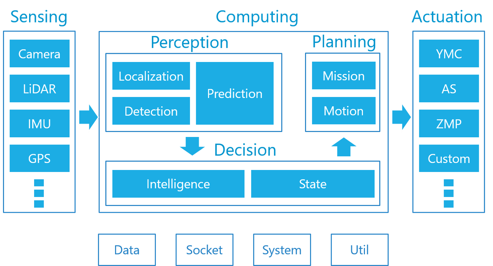

## Sensing

### Camera

* [PointGrey (FLIR) Grasshopper 3 (USB/GigE)](https://www.ptgrey.com/grasshopper3-usb3-vision-cameras)
* PointGrey (FLIR) Flea 2/3 (USB/GigE)[link](https://www.ptgrey.com/flea3-gige-vision-cameras)
* PointGrey (FLIR) Blackfly (USB3/GigE) [link](https://www.ptgrey.com/blackfly-usb3-vision-cameras)
* Baumer VLG-22C (USB3/GigE)[link](https://www.baumer.com/sg/en/product-overview/image-processing-identification/industrial-cameras/long-term-availability/visiline-series/ams-cmosis-sensors/vlg-22c/p/24060)
* Baumer VCXU-24C (USB3/GigE)[link](https://www.baumer.com/us/en/product-overview/image-processing-identification/industrial-cameras/cx-series/usb-3-0-interface/vcxu-24c/p/23796)
* Allied Vision Camera Mako G-319C (PoE GigE) [link](https://www.alliedvision.com/en/products/cameras/detail/Mako%20G/G-319.html)
* Generic UVC Webcam (USB2/3)

Autoware支持多个相机，每个相机被分配到独立工作，用于目标检测和目标识别等。Autoware不支持图像融合。

### LiDAR

* VELODYNE HDL-64E (S1/S2/S3)[link](http://velodynelidar.com/hdl-64e.html)
* VELODYNE HDL-32E[link](http://velodynelidar.com/hdl-32e.html)
* VELODYNE VLP-32C[link](http://velodynelidar.com/vlp-32c.html)
* VELODYNE VLP-16[link](http://velodynelidar.com/vlp-16.html)
* VELODYNE VLP-16 Lite [link](http://velodynelidar.com/vlp-16-lite.html)
* VELODYNE VLP-16 Hi-Res [link](http://velodynelidar.com/vlp-16-hi-res.html)
* HOKUYO YVT-35LX (3D-URG) [link](https://www.hokuyo-aut.co.jp/search/single.php?serial=165)
* HOKUYO UTM-30LX (TOP-URG) [link](http://www.senteksolutions.com/products/scanning-laser-rangefinders/utm-30lx)
* SICK LMS511 [link](https://www.sick.com/us/en/detection-and-ranging-solutions/2d-lidar-sensors/lms5xx/lms511-10100-pro/p/p215941)
* PIONEER 3D LiDAR (yet to be released) [link](http://global.pioneer/en/news/press/2017/pdf/1130-1.pdf)

为目标检测、目标跟踪和定位提供丰富的点云数据。

### RADAR

* Delphi ESR [link](https://autonomoustuff.com/product/delphi-esr-2-5-24v/)

Autoware的传感器部分主要基于激光雷达，也支持毫米波雷达用于长距离的目标跟踪，但将其整合到感知工具包的工作尚未完成。

### IMU

* Memsic VG440 [link](http://www.aceinna.com//VG440CA-200%7C400)
* Xsens MTi-300 [link](https://www.xsens.com/products/mti-100-series/)
* MicroStrain 3DM-GX5-15 [link](http://www.microstrain.com/inertial/3dm-gx5-15)
* Novatel IGM S1 IMU [link](https://www.novatel.com/products/span-gnss-inertial-systems/span-imus/span-mems-imus/imu-igm-s1/)

惯性测量单元(IMU)是测量物体三轴姿态角(或角速率)以及加速度的装置。
> 注：
> 虽然Autoware支持IMU驱动并将数据集成到本地化模块。但是Autoware研发团队认为在不使用IMU的情况下，由3D地图和里程表增强的基于SLAM的本地化足够可靠。

### GPS/GNSS

* Javad DELTA-3 [link](https://www.javad.com/jgnss/products/receivers/delta-3.html)
* MITSUBISHI AQLOC (only available in Japan) [link](http://www.mitsubishielectric.co.jp/news/2017/1129.html)
* Trimble NetR9 [link](http://www.trimble.com/Infrastructure/Trimble-NetR9.aspx)
* Leica Viva GS25 [link](https://leica-geosystems.com/products/gnss-systems/receivers/leica-viva-gs10-gs25)
* Applanix APX-15 UAV [link](https://www.applanix.com/products/dg-uavs.htm)

Autoware支持绝大部分GPS/GNSS。

## Computing/Perception

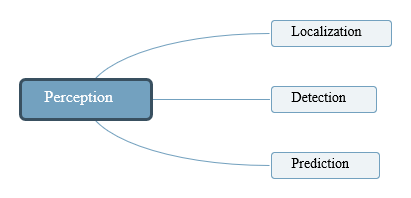

感知模块包括定位（Localization），检测（Detection）和预测（Prediction）三大功能。定位功能通过3D map和SLAM算法，并结合GNSS和IMU传感器实现。检测功能使用了相机和激光雷达，结合传感器融合算法和深度学习网络进行目标检测。预测功能基于定位和检测结果实现。

### Localization

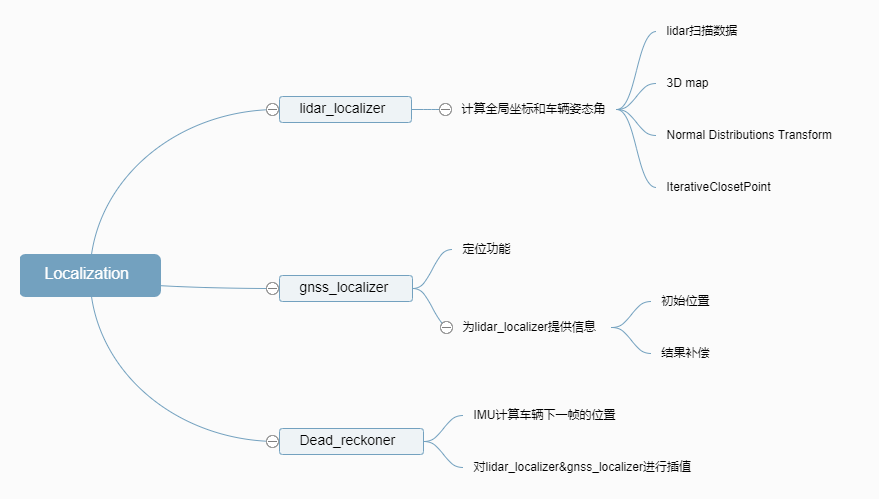
 
* lidar_localizar 计算车辆当在全局坐标的当前位置(x,y,z,roll,pitch,yaw)，使用LIDAR的扫描数据和预先构建的地图信息。Autoware推荐使用Normal Distributions Transform (NDT)算法将激光雷达扫描数据和三维地图进行匹配，同时也支持最近点Iterative Closet Point(ICP)算法。
* gnss_localizer 转换GNSS接收器发来的NEMA消息到位置信息(x,y,z,roll,pitch,yaw)。结果可以被单独使用为车辆当前位置，也可以作为lidar_localizar的初始参考位置和结果补偿。
* dead_reckoner 主要使用IMU传感器预测车辆的下一帧位置，也可以用来对lidar_localizar和gnss_localizar的结果进行插值。

### Detection

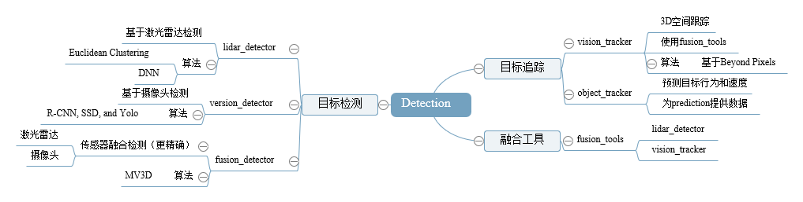

* lidar_detector  从激光雷达单帧扫描读取点云信息，提供基于激光雷达的目标检测。主要使用欧几里德聚类算法，从地面以上的点云得到聚类结果。除此之外，可以使用基于卷积神经网路的算法进行分类，如VoxelNet,LMNet。
* vision_detector 读取来自相机的图片，提供基于图像的目标检测。主要的算法包括R-CNN，SSD和Yolo，可以进行多类别(汽车，行人等)实时目标检测。
* vision_tracker 使用vision_detector的检测结果完成目标跟踪功能。算法基于Beyond Pixels，图像上的目标跟踪结果被投影到3D空间，结合lidar_detector的检测结果输出最终的目标跟踪结果。

* fusion_detector 输入激光雷达的扫描点云和摄像头的图片信息，进行在3D空间的更准确的目标检测。激光雷达的位置和摄像头的位置需要提前进行联合标定，现在主要是基于MV3D算法来实现。
fusion_tools将lidar_detector和vision_detector的检测结果进行融合，vision_detector的识别类别被添加到lidar_detector的聚类结果上。

* fusion_tools 融合了激光雷达和相机的采集数据结果。 将vision_detector标识的类信息添加到由lidar_detector检测到的点云聚类上。

* object_tracker 预测检测目标的下一步位置，跟踪的结果可以被进一步用于目标行为分析和目标速度分析。跟踪算法主要是基于卡尔曼滤波器。

### Prediction

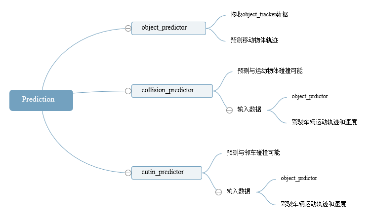

* object_predictor 利用目标跟踪（object_tracker)的计算结果来预测移动物体的未来轨迹，例如行人、汽车等。

* collision_predictor 利用object_predictor的计算结果来预测 
预测未来是否会与跟踪目标发生碰撞。输入的信息包括车辆的跟踪轨迹，车辆的速度信息和目标跟踪信息。

* cutin_predictor 利用和collision_predictor一样的信息，来预测周围的车辆是否会切入自身车辆前方。

## Computing/Decision

决策模块连接感知模块和规划模块。接收到感知模块的计算结果，Autoware会决定一种由有限状态机表示的驾驶行为，这样便于规划模块制定正确的计划，目前决策制定基于规则系统。

### Intelligence

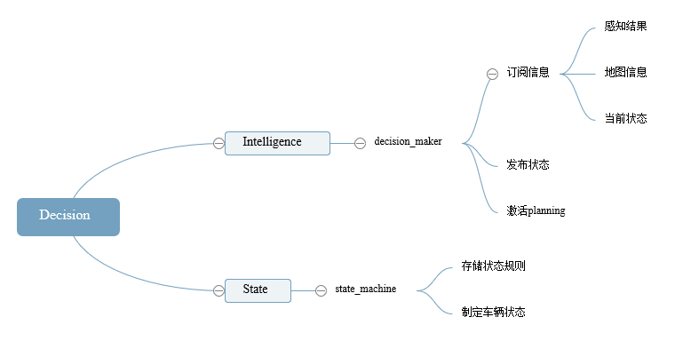

* decision_maker 订阅大量关于感知结果、地图信息和当前状态的主题，以便发布下一刻的状态主题。状态更改将激活适当的规划模块功能。

### State

* state_machine 在预定义规则内更改状态，并与Decision_maker协调。

## Computing/Planning

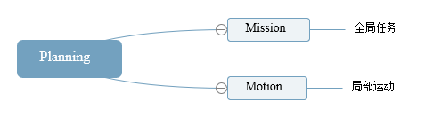

规划模块主要是基于感知的输出结果，进行全局路径规划和局部路径规划。全局路径规划在车辆启动或重启的时候被确定，局部路径根据车辆的状态进行实时更新。例如，如果车辆在障碍物前或停止线前，车辆状态变为“stop”，那么车辆的速度就被规划为0。如果车辆遇到一个障碍物且状态为“avoid”,那么局部跟踪路径就会被重新规划绕过障碍物。

### Mission

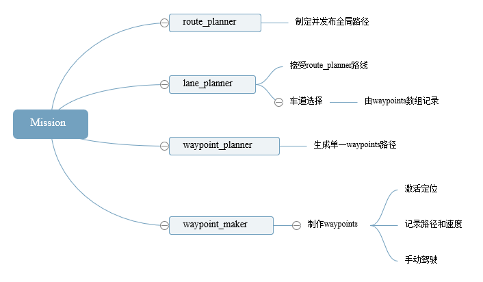

* route_planner 寻找到达目标地点的全局路径，路径由道路网中的一系列十字路口组成。

* lane_planner 根据route_planner发布的一系列十字路口结果，确定全局路径由哪些lane组成，lane是由一系列waypoint点组成，一个waypoint对应一条车道。

* waypoint_planner 可以被用于产生到达目的地的一系列waypont点，它与lane_planner的不同之处在于它是发布单一的到达目的地的waypoint路径,而lane_planner是发布到达目的地的一系列waypoint数组。

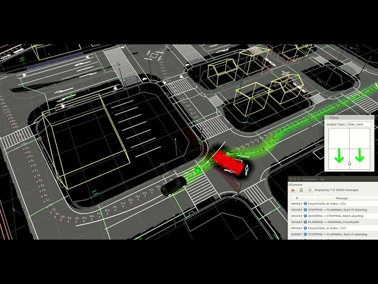

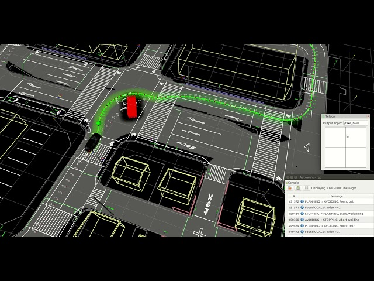

如上图，waypoint_planner在接收到Decision发送的"voide"状态后，会规划出一条局部的路线来避开障碍物。所以个人认为该包应放在Motion中，与astar_planner一起工作。

* waypoint_maker 是一个保存和加载手动制作的waypoint文件的工具。为了保存waypoint到文件里，需要手动驾驶车辆并开启定位模块，然后记录车辆的一系列定位信息以及速度信息， 被记录的信息汇总成为一个路径文件，之后可以加载这个本地文件，并发布需要跟踪的轨迹路径信息给其他规划模块。

### Motion

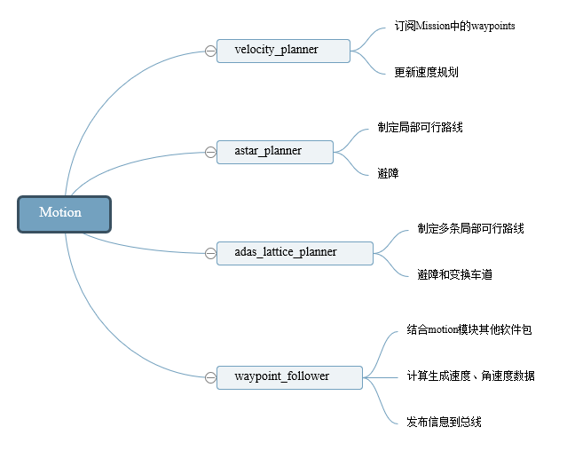

* velocity_planner 根据lane_planner,waypoints_planner, 或者waypoints_maker更新车辆速度信息，这个模块就是根据车辆的实际状态进一步修正速度信息，以便于实现在停止线前面停止下来或者加减速等等。

>注：
>给定跟踪的waypoint里面是带有速度信息的。

* astar_planner 实现Hybrid-State A*查找算法，生成从现在位置到指定位置的可行轨迹，这个模块可以实现避障，或者在给定waypoint下的急转弯，也包括在自由空间内的自动停车。

* adas_lattice_planner 实现了State Lattice规划算法，基于样条曲线，事先定义好的参数列表和语义地图信息，在当前位置前方产生了多条可行路径，可以被用来进行障碍物避障或车道线换道。

* waypoint_follower 这个模块实现了Pure Pursuit算法来实现轨迹跟踪，可以产生一系列的控制指令来移动车辆，这个模块发出的控制消息可以被车辆控制模块订阅，或者被线控接口订阅，最终就可以实现车辆自动控制。

## Actuation

Autoware的计算输出是一组速度、角速度、轮角和曲率。这些信息通过车辆接口作为命令发送给有线控制器。控制转向和油门，需要由线控器来控制。
